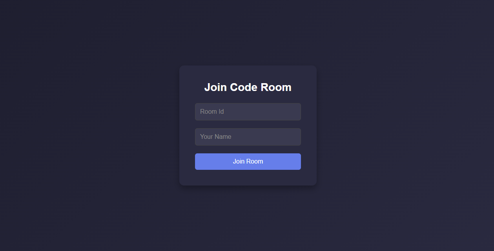
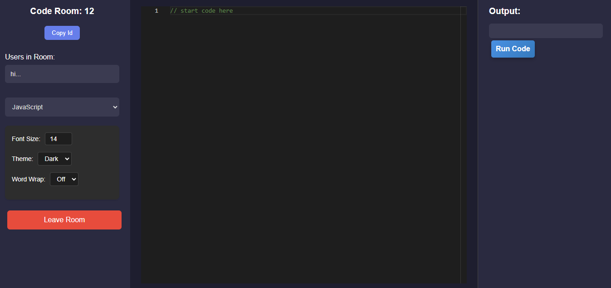
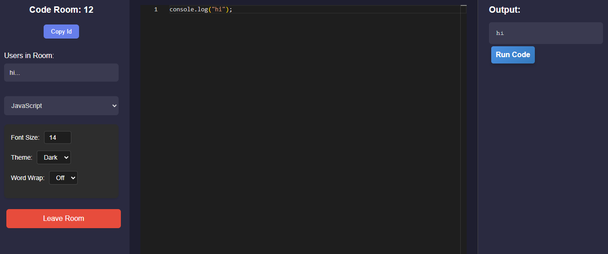

# AI-Assisted NE-IDE

<p align="center">
  
  <br>
  <strong>NE-IDE</strong>
</p>

The **AI-Assisted Real-Time Code Editor (NE-IDE)** is a lightweight, collaborative code editor designed for developers to work together in real-time. It features a modern, dark-themed interface with smooth animations, AI-powered code assistance, and a user-friendly design. The editor supports multiple programming languages, real-time collaboration, and interactive UI elements like modals for AI outputs and error messages.

---

## Features

### 1. **Code Editor**
- Lightweight integration with syntax highlighting for multiple programming languages.
- Dark theme with customizable options for better readability.
- Features word wrap, line numbering, bracket matching, and automatic indentation.
- Collapsible sidebar for easy navigation and maximized workspace.

### 2. **AI-Powered Code Assistance**
- AI-driven auto-completion for function names, variables, and keywords.
- Real-time linting with quick-fix suggestions displayed in a sleek modal.
- Predefined code snippets for frequently used code blocks.
- AI-powered code documentation generation, presented in a dedicated panel.

### 3. **Real-Time Collaboration**
- Multi-user editing with live cursor positioning and typing indicators.
- In-editor activity log to track recent edits and user actions.
- Room-based collaboration with copyable room IDs for easy sharing.
- Auto-save and undo/redo history for version control.

### 4. **Security & Authentication**
- Email and Google OAuth login for secure access.
- Two-factor authentication (2FA) via OTP or TOTP.
- Private and public workspaces with controlled access.
- Password reset functionality for user convenience.

### 5. **User Experience & UI Enhancements**
- Modern dark theme with smooth gradients and subtle animations (e.g., fade-ins, slide-ins).
- Card-based modal for displaying AI outputs and error messages with animated transitions.
- Interactive buttons with hover and click animations for a responsive feel.
- Collapsible sidebar and customizable font sizes for a tailored experience.

---

## Demo

<p align="center">
  
  <br>
  <em>Join Room Interface with animated form</em>
</p>
<p align="center">
  
  <br>
  <em>Editor Interface with sidebar, code editor, and output panel</em>
</p>
<p align="center">
  
  <br>
  <em>AI Modal with animated error and AI output display</em>
</p>

---

## Installation

### Prerequisites
- Node.js (v16 or higher)
- MongoDB (v5 or higher)
- OpenAI API key for AI-powered features
- Judge0 API key (optional for code execution in non-JavaScript languages)

### Steps
1. Clone the repository:
   ```bash
   git clone https://github.com/your-repo/ai-code-editor.git
   cd ai-code-editor